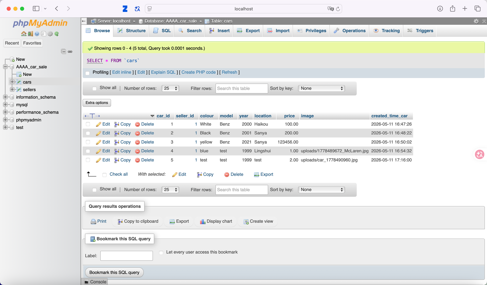
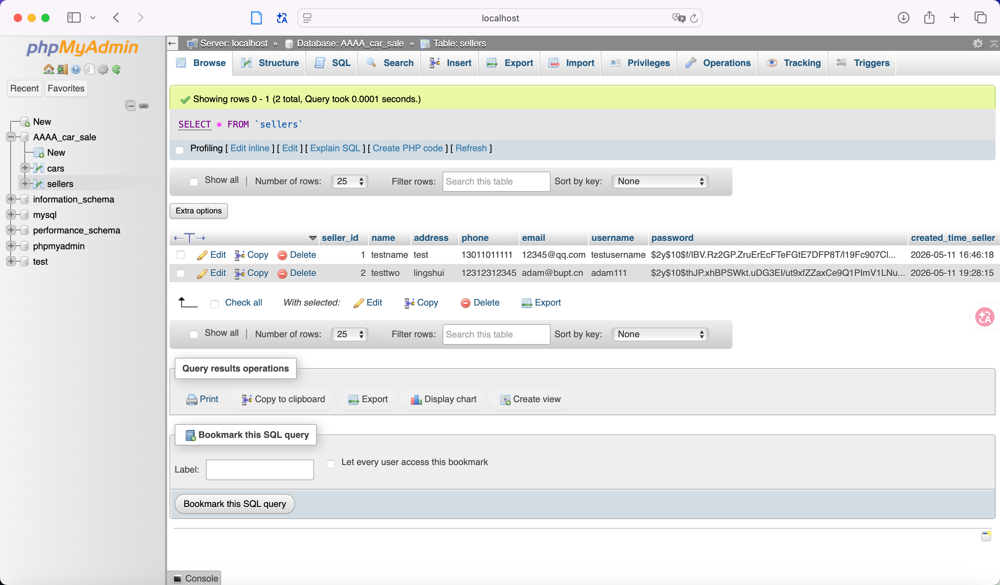

# AAAA Online Car Sale

### QHE4103 Fundamentals of Web Technology – Phase A Delivery 1 and Phase B

**Authentic Automotive Assurance Avenue**

A responsive online car sale website developed collaboratively through GitHub workflow.  
This repository was first used for Phase A Delivery 1 front-end development and was later extended in the same repository for Phase B back-end development.

 

---

## Project Introduction

This repository contains the source code for the **AAAA Online Car Sale** website project for **QHE4103 Fundamentals of Web Technology**.

This repository mainly records two development stages:

- **Phase A Delivery 1:** non-AI front-end website development using HTML, CSS and JavaScript.
- **Phase B:** back-end development using PHP and MySQL based on the Phase A Delivery 1 website.

The website is named **AAAA**, which stands for:

> **Authentic Automotive Assurance Avenue**

The main functions of the website include:

- sellers can register an account;
- sellers can log in with username and password;
- logged-in sellers can publish car advertisements;
- buyers can search for cars by model and year;
- seller information and car information can be stored in and retrieved from the database.

---

## Team Members and Contributions

### Phase A Delivery 1 Contributions

| Team Member | Main Contribution |
|-------------|-------------------|
| **Wang Zhongrui** | Repository setup, project coordination, add car page, README integration, progress tracking |
| **Zhang Hanmin** | Homepage design and implementation, visual style exploration, logo direction, meeting minutes writing |
| **Liu Xiaomeng** | Registration and login pages, validation-related requirement checking, bug finding |
| **Wang Yian** | Search page, GitHub workflow support, collaboration troubleshooting, picture collection |

### Phase B Contributions

| Team Member | Feature Branch | Main Responsibility |
|-------------|----------------|---------------------|
| **Zhang Hanmin** | `feature-seller_registration_backend` | Seller registration backend |
| **Liu Xiaomeng** | `feature-login_backend` | Seller login, logout and session backend |
| **Wang Zhongrui** | `feature-add_car_backend` | Add car backend |
| **Wang Yian** | `feature-search_backend` | Buyer search backend |

For Phase B, the work was divided into four back-end features. Each member worked on one back-end feature branch and merged the completed work into the `develop` branch through pull requests.

---

## Website Pages

The current website mainly includes the following pages:

| Page | Description |
|------|-------------|
| **Homepage** | Introduces the company and provides links to the main pages |
| **Registration Page** | Allows sellers to create an account |
| **Login Page** | Allows registered sellers to log in |
| **Add Car Page** | Allows logged-in sellers to submit car advertisements |
| **Search Page** | Allows buyers to search for cars by model and year |

---

## Existing Front-end Features

### Front-end Features

- Responsive page layout;
- Consistent navigation bar;
- Seller registration form;
- Seller login form;
- Add car form with image upload field;
- Search form and result display;
- JavaScript regular expression validation;
- Black-and-gold visual style.

### Back-end Features

- MySQL database connection;
- Seller data storage;
- Server-side form processing;
- Password hashing;
- Login verification;
- Session handling;
- Logout function;
- Add car access protection;
- Car data storage;
- Search result retrieval from database.

---

## Database Design

The project uses a MySQL database named:

`AAAA_car_sale`

The database mainly contains two tables:

- `sellers` — stores registered seller information;
- `cars` — stores car advertisements published by sellers.

The `cars` table uses `seller_id` to connect car advertisements with sellers.

### Cars Table

### Sellers Table

---

## Main Backend Files

The main back-end files used in Phase B include:

| File | Purpose |
|------|---------|
| `database.sql` | Defines the database and tables |
| `db_connect.php` | Connects PHP files to the MySQL database |
| `auth_check.php` | Checks whether a seller is logged in |
| `registration.php` | Displays the seller registration form |
| `registration_process.php` | Processes seller registration data |
| `login.php` | Displays the seller login form |
| `login_process.php` | Processes seller login and creates session variables |
| `logout.php` | Logs the seller out and clears the session |
| `addcar.php` | Displays the add car form |
| `addcar_process.php` | Processes car advertisement submission |
| `search.php` | Displays the buyer search form |
| `search_results.php` | Retrieves matching car data from the database |

---

## Development Workflow and Testing

The team continued using GitHub workflow in Phase B. The project mainly used `main`, `develop`, and back-end feature branches. Each member worked on one back-end feature branch and merged the completed work into the `develop` branch through pull requests.

The main Phase B feature branches include:

- `feature-seller_registration_backend`
- `feature-login_backend`
- `feature-add_car_backend`
- `feature-search_backend`

During integration, the team tested the main back-end functions, including registration, login, logout, session handling, add car, and search. Some minor issues, such as navigation links and file paths, were recorded through GitHub Issues and improved during later updates.

---

## Collaboration and Teamwork

Our team focused not only on code implementation, but also on development process, task division, and integration management.

Our collaboration process included:

- Regular group meetings;
- Requirement analysis;
- GitHub feature branch workflow;
- Pull request based integration;
- Issue-based improvement after merging;
- Back-end agreement before implementation;
- Final testing and review.

---

##  Website Preview

## Website Preview

### Homepage

  

### Registration / Login

  

  

### Add Car Page

  

### Search Page

  

  

---

**AAAA — Authentic Automotive Assurance Avenue**  
Built collaboratively for **QHE4103 Fundamentals of Web Technology**

