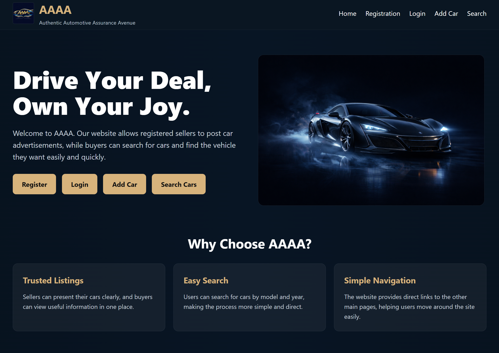
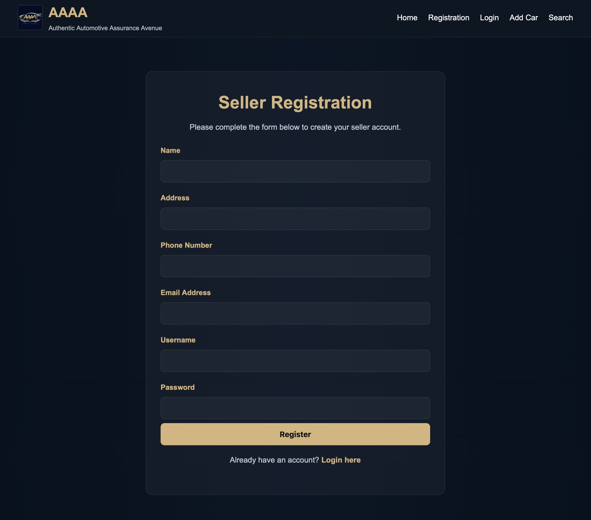
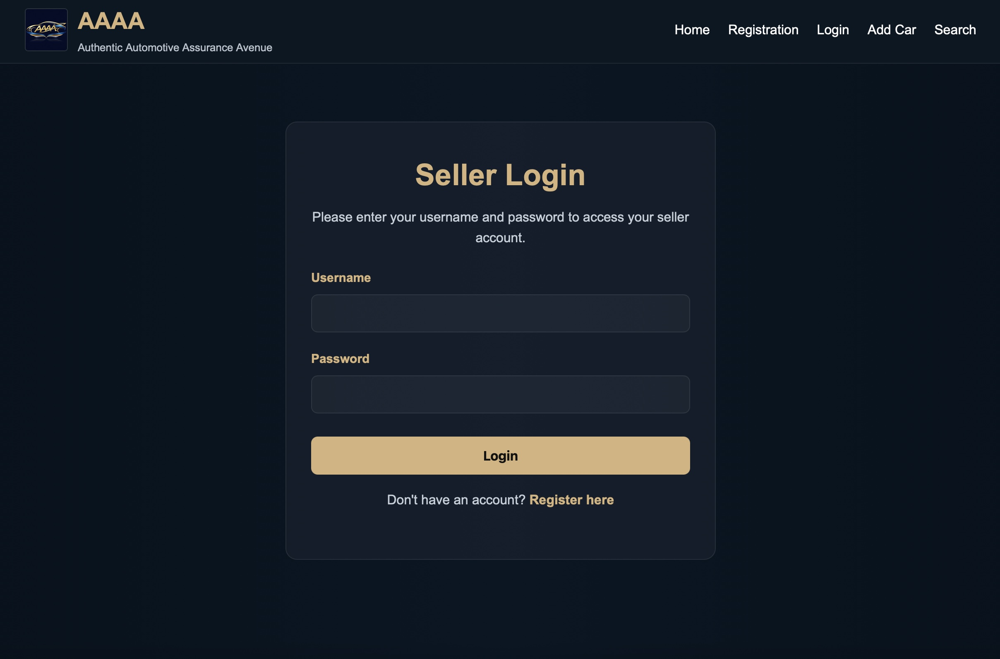
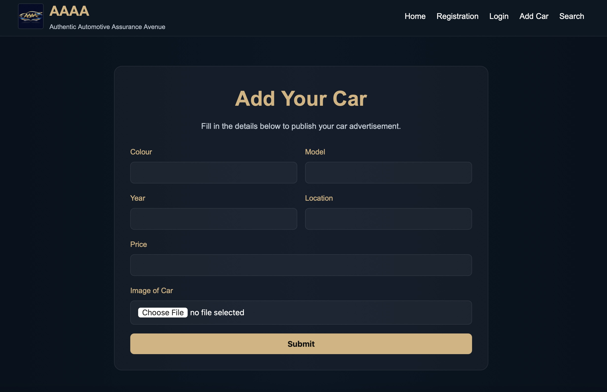
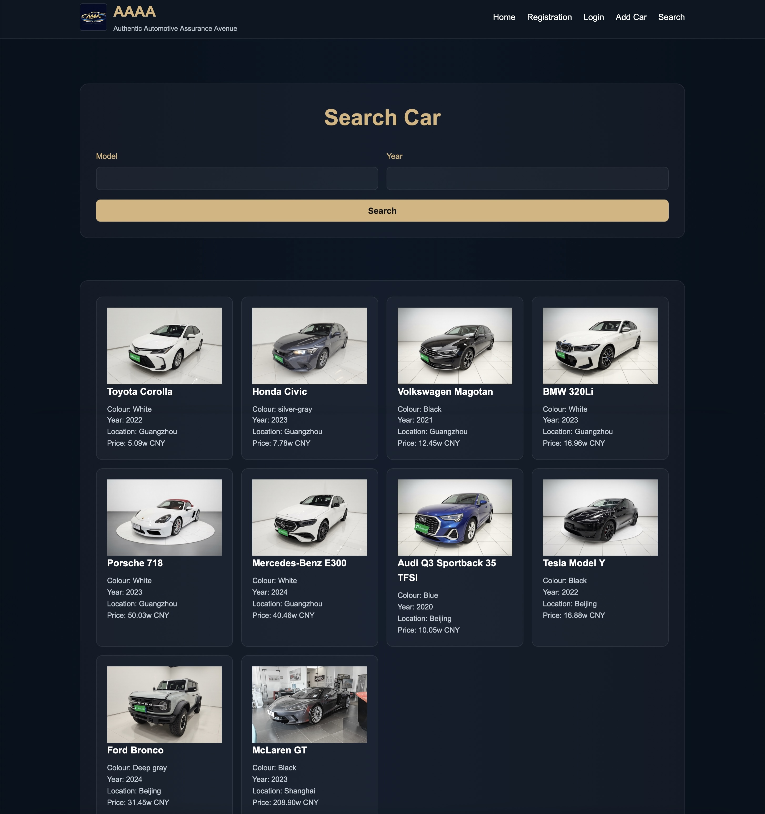
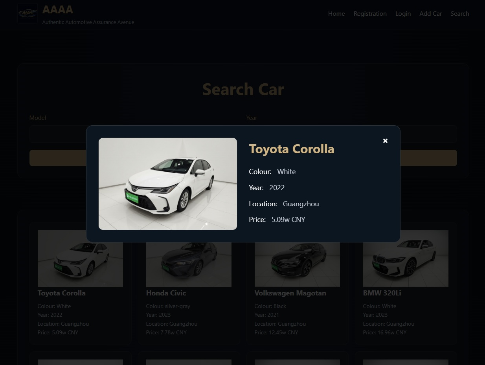

# AAAA Online Car Sale
### QHE4103 Fundamentals of Web Technology – Phase A + B (Delivery 1 + 3)

**Authentic Automotive Assurance Avenue**

A website for a fictitious online car sale company, developed collaboratively through a structured GitHub workflow.

 

---

## Project Introduction

This repository contains the source code for **Phase A – Delivery 1** and **Phase B – Delivery 3** of the **QHE4103 Fundamentals of Web Technology** coursework.

The project follows a structured GitHub workflow, including a shared remote repository, feature branches, pull requests, and regular group progress tracking.

Our website is named **AAAA**, which stands for:

> **Authentic Automotive Assurance Avenue**

The website is designed to provide a simple and readable platform where:

- **Sellers** can register, log in, and advertise their cars
- **Buyers** can search for cars by model and year
- **Users** can navigate smoothly between all main pages

---

## Delivery 3 Back-end Development Overview

<!-- To be completed after implementation. -->

---

## Database Design

<!-- To be completed after implementation. -->

---

## PHP and Server-side Functionality

<!-- To be completed after implementation. -->

---

## Delivery 3 Feature Responsibilities

| Team Member | Delivery 3 Feature | Branch Name | Current Status | Notes |
|-------------|-------------------|-------------|----------------|-------|
| **Wang&nbsp;Zhongrui** |  |  |  |  |
| **Zhang&nbsp;Hanmin** |  |  |  |  |
| **Liu&nbsp;Xiaomeng** |  |  |  |  |
| **Wang&nbsp;Yian** |  |  |  |  |

---

## Delivery 3 Progress Notes

<!-- To be completed after implementation. -->

---

## Delivery 3 Testing Notes

<!-- To be completed after implementation. -->

---

## Delivery 3 Submission Preparation

<!-- To be completed after implementation. -->

---

# Previous Phase A Content

The following sections are retained from the previous README to preserve the original front-end project information and teamwork record.

---

## Team Members and Contributions

| Team Member | Role | Main Contribution |
|-------------|------|-------------------|
| **Wang&nbsp;Zhongrui** | Team&nbsp;Leader | Repository setup, project coordination, add car page, README integration, progress tracking |
| **Zhang&nbsp;Hanmin** | Member | Homepage design and implementation, visual style exploration, logo direction, Meeting Minutes writing |
| **Liu&nbsp;Xiaomeng** | Member | Registration and login pages, validation-related requirement checking, bug finding |
| **Wang&nbsp;Yian** | Member | Search page, GitHub workflow support, collaboration troubleshooting, pictures collecting |

---

## Website Pages

The current website includes the following main pages:

| Page | Description |
|------|-------------|
| **Homepage** | Introduces the company, displays the logo, and provides links to all key pages |
| **Registration Page** | Allows sellers to create an account through a validated form |
| **Login Page** | Allows sellers to log into the system |
| **Add Car Page** | Allows sellers to submit a car advertisement with car details |
| **Search Page** | Allows users to search for cars by model and year and view detailed results |

---

## Existing Front-end Features

- Responsive page layout
- Consistent navigation bar across major pages
- Seller registration form
- Seller login form
- Add car form with image upload field
- Search functionality by **model** and **year**
- Search result display with detailed car information
- Client-side validation using JavaScript regular expressions
- Unified black-and-gold visual style

---

## Design Concept

Our team aimed to create a website that is:

- **clean**
- **easy to read**
- **visually consistent**
- **simple to navigate**

After discussion and style research, we chose a **black-and-gold** colour theme to give the website a more polished and premium appearance suitable for an online car sale platform.

---

## Website Preview

### Homepage

  

### Registration / Login

  

  

### Add Car Page

  

### Search Page

  

  

---

## Collaboration and Teamwork

Our team paid close attention not only to coding, but also to how we worked together throughout the project.

### Our collaboration process included:

- regular meetings from planning to final testing
- shared analysis of coursework requirements
- discussion of wireframes before implementation
- GitHub workflow learning and mutual support
- pull request based integration
- issue-based improvement after merging
- final testing and collective review

### Meeting Overview

To make our process clear and traceable, we recorded our development progress through a series of meetings.

| Meeting | Date | Main Focus |
|--------|------|------------|
| **Meeting&nbsp;1** | 24&nbsp;Mar&nbsp;2026 | Team formation, leader confirmation, repository creation, initial project understanding |
| **Meeting&nbsp;2** | 28&nbsp;Mar&nbsp;2026 | Requirement analysis, workflow discussion, timeline planning, style research preparation |
| **Meeting&nbsp;3** | 3&nbsp;Apr&nbsp;2026 | Feature branch creation, task allocation, wireframes, HTML structure planning |
| **Meeting&nbsp;4** | 8&nbsp;Apr&nbsp;2026 | Website naming, logo discussion, progress review, HTML skeleton deadline |
| **Meeting&nbsp;5** | 10&nbsp;Apr&nbsp;2026 | Unified style decision, homepage as reference page, intensive coding plan |
| **Meeting&nbsp;6** | 11&nbsp;Apr&nbsp;2026 | GitHub problem-solving, path discussion, README task added |
| **Meeting&nbsp;7** | 14&nbsp;Apr&nbsp;2026 | Requirement re-checking, CSS naming unification, PR merging, issue-based refinement planning |
| **Meeting&nbsp;8** | 16&nbsp;Apr&nbsp;2026 | Final testing, responsive layout check, validation review, final integration and README completion |

### Issues

To make collaboration more visible and organised, our team used **Issues** during development.

#### Issues were used to:

- record integration problems
- track navigation or file naming problems
- organise follow-up improvements after merging

#### Examples of collaboration topics included:

- inconsistent page links and redirects
- CSS filename conflicts during merging
- navigation checking across all pages
- improvements to search result interaction

---

**AAAA — Authentic Automotive Assurance Avenue**  
Built collaboratively for **QHE4103 Fundamentals of Web Technology**

